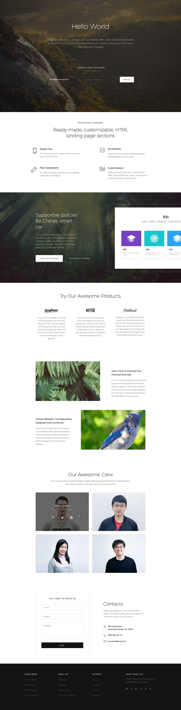

**目标**

学习如何将一个设计稿转化为网页，通过这个过程实战之前学到的各种CSS知识，掌握切图。

**任务**

按照如下设计图，进行页面的实现

1、代码风格符合某种编码规范

2、尽可能按照设计稿的尺寸进行实现

3、设计稿中的图片或文字素材在实现时可以不一致

4、充分应用上之前学习到的各种布局方式，尽可能几种方式都运用尝试一次，比较各种布局的适用场景

5、设计稿中下方导师介绍图片，左上角灰色底表示，鼠标hover到图片上时的效果变化。

6、不需要考虑兼容IE浏览器

